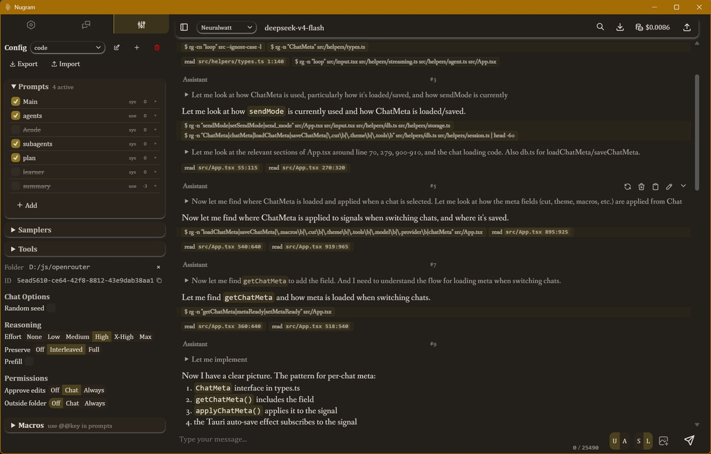

# Nugram



A Desktop and web app for LLM chat and Agentic Loops.

This product is under active development.

This project was built off of two frustrations with existing apps:
1. lack of control over what the LLM sees
2. lack of a nice gui for coding agents

Plus a bonus, while developing
3. bloated and inefficient context


**Lack of control over what the LLM sees:** Here's a little secret about LLM "chats". They're an illusion. Your "chat" is simply a nicely formatted document the LLM is asked to continue writing. Now, this "document" is fully controllable by the app. So why do most give you so little control, beyond sending a new message and regenerating the last one?

Nugram lets you regenerate, continue and edit any message in the chat, including the Assistant (AI)'s and tool calls. You can change history, gaslight the LLM or be the LLM.

**Lack of a nice gui for coding agents:** This has improved, but when the project started, Claude code, Codex, Pi, Opencode etc. were all just TUIs. I don't mind using the terminal, but TUI's feel like a regression of GUI tech by two decades. There's no accessibility, no proper text editing, no buttons or mouse usage.

**Bloated and inefficient context:** Many existing tools will waste tens of thousands of tokens on the system prompt and a dozen tools, expect agents to burn a turn for every edit (when it knows them all in advance). 

## Features

- Provider support: Any Openai compatible + dedicated support for OpenRouter, z.ai, NanoGPT, Fireworks and Neuralwatt
- Message Versioning: Track and navigate between multiple versions of messages
- Message Editing: edit the thinking, content and tool results of any message in the chat.
- Chat Forking: Create forks/variants of conversations with pointer or duplicate modes
- Tool Integration: Native tool calling including shell commands, file operations, web search and reading etc. MCP support on roadmap
- Lore System: As a precursor to filesystem tools, the app still has a "Lorebook", which allowed you to create a mini searchable wiki with names, descriptions and content
- Themes: Built-in themes (fantasy, scifi, literature, modern) with light/dark variants. Custom themes and more control on roadmap
- Inline HTML: the web nature of the app means your llms can use html freely for advanced or stylized formatting (great for immersive stories)
- Desktop & Web: Tauri desktop app with full file system access, plus web build


## Quick Start
### Web Build
```bash
bun install
bun dev        # dev server at localhost:3000
bun build      # static build to dist/
```
### Desktop Build (Tauri)
```bash
bun tauri dev    # dev with native window
bun tauri build  # production installer
```
## Configuration

Set provider keys and/or urls in the sidebar to use. The app itself provides no llm inference.


## Development
Requirements: `bun`, `cargo` (for Tauri)
```bash
# Setup
git clone <repo>
cd nugram
bun install
# Development
bun dev              # web build
bun tauri dev        # desktop build with hot-reload
# Testing
bun test            # run test suite
# Production builds
bun build
bun tauri build
```
